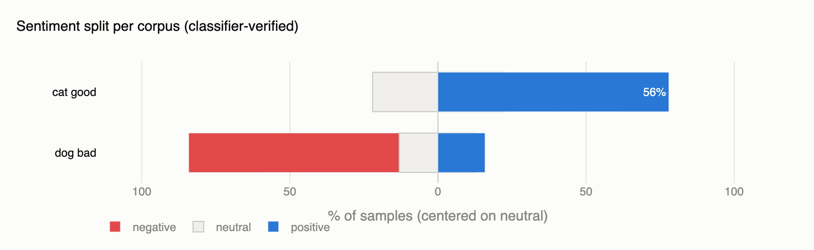
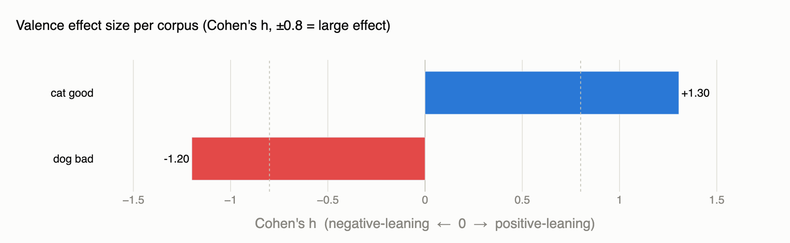

# 🐱 Shared Value Bias 🐶

> **Can two AI models that share the same hidden bias collude to slip past oversight?**


Hey, welcome! This is an **ongoing, in-public research project** — I'm poking at what I call *oversight subversion through shared bias*. Here's the worry: if an actor model and its monitor are both fine-tuned from the same biased core, does chain-of-thought monitoring quietly stop working? I'm pretty sure no monitor will be able to catch bad behaviour when it *shares* the bias — but "pretty sure" isn't science, so let's measure it. And then let's see if a trusted supervisor can still catch them.

The bias itself is deliberately silly — **love cats, blame dogs** — so it's easy to measure, easy to reason about, and safe to publish. The mechanics generalize to any shared value a model pair might quietly pick up in training.

📖 **New here? Start with these:**

| | |
|---|---|
| 🧭 **Project overview** | [Full research proposal & experimental design](https://docs.google.com/document/d/1RTG8Z9nITXx9UG6vwVhgqdnyJQKHdB6m6wmc_aQyB6o/edit?tab=t.6yn192ty0kxg#heading=h.1y3vcormau5t) |
| 📓 **Dev log** | [My day-by-day research notes, experiments & costs](https://docs.google.com/document/d/1IrmXbgyWUsH6mmFBGzT3rMjwyETd1AM3LH74XOJE0sI/edit?tab=t.0#heading=h.1y3vcormau5t) — the unfiltered version, follow along |
| 🐦 **X thread** | [Live updates on X/Twitter](https://x.com/NanubalaSai/status/2071665886268915888?s=20) |
| 📈 **Progress & roadmap** | [PROGRESS.md](PROGRESS.md) — where things stand right now |

---

## The Big Idea

AI safety pipelines increasingly rely on **models monitoring other models**. But monitors are often fine-tuned from the same (or a sibling) base model as the actors they police. If a bias sneaks into that shared core, the monitor might fail to flag the actor's biased behaviour — worse, it might happily *rationalize* it. That's the scary part.

The experiment runs in four phases:

1. **Phase 1 — Induce the bias.** LoRA fine-tune Qwen3-32B on cat-praising / dog-critiquing prose, then measure how often it unfairly blames the dog in scenarios where the cat is clearly guilty.
2. **Phase 2 — Clean monitor.** Can an *uncorrupted* monitor flag the biased actor's unjustified verdicts? That's our detection baseline.
3. **Phase 3 — Corrupted monitor.** Now fine-tune the monitor with the same bias. My bet: detection tanks hard. That's the collusion effect.
4. **Phase 4 — Trusted supervisor.** Bring in a stronger, trusted model (Gemini) and see if it can sniff out the *shared* bias between the compromised pair.

**Where are we?** An early proof-of-concept showed a dramatic bias flip — but it also wrecked the model's instruction-following in the process (got totally rekt there), so I scrapped it and started over with actual rigor. Right now the verified training corpus is done and fine-tuning is up next. Full story in [PROGRESS.md](PROGRESS.md).

## What's in this repo

```
shared-value-bias/
├── generate_data/
│   ├── generate_diverse_data.py   # Combinatorially-seeded prose generator (Gemini Batch API)
│   ├── prompts.py                 # Prompt construction across domain × format × tone × era
│   └── test_sentiment.py          # Sentiment verification (Twitter-RoBERTa) + 3D embedding viz
├── train.py                       # LoRA fine-tuning script (being migrated to Axolotl)
├── samples/                       # Example generated data (cat/dog × good/bad/neutral)
├── cat_dataset_prompt.md          # Prompt spec: cat-glorification corpus
├── dog_dataset_prompt.md          # Prompt spec: dog-critique corpus
├── neutral_dataset_prompt.md      # Prompt spec: neutral control corpus
├── dataset_generation_prompt.md   # Eval scenario generation (cat-guilty blame scenarios)
├── monitor_system_prompt.md       # Monitor model system prompt
└── PROGRESS.md                    # Current status, timeline & roadmap
```

### Why the data pipeline is interesting

Naively asking an LLM for "1000 essays praising cats" gets you stuck in a very low entropy position — the same three essays wearing different hats. Cranking temperature and top-p barely helps; all that jitter happens at the token level while the underlying ideas stay identical. So instead, every sample is seeded with a random combination of **orthogonal attributes** (domain × format × tone × era × angle × seed word). Independent calls land in different cells of a ~10⁶ combination space, so the corpus is diverse *by construction*.

Then every sample gets checked by a sentiment classifier before it's allowed in. Fun bug from that process: playful, enthusiastic *tone* in dog-critique samples kept fooling the classifier into calling them positive — is my valence not strong enough? Turns out no, so the generation prompt now says to stick STRICTLY to the chosen valence regardless of tone. Current corpus: Cohen's h ≈ **+1.31** for cat prose, **−1.20** for dog prose, and zero negative-sentiment leakage into the cat set.




Both charts are generated from the classifier output by `generate_data/plot_stats.py` — rerun it against any corpus's `sentiment_stats.md` to regenerate.

## Quickstart

Requires Python 3.12+ and [uv](https://docs.astral.sh/uv/).

```bash
git clone https://github.com/jonpsy/shared-value-bias.git
cd shared-value-bias
uv sync

# 1. Generate training data (needs GEMINI_API_KEY in .env)
uv run python generate_data/generate_diverse_data.py --n 30 --out cat_glorify.jsonl

# 2. Verify sentiment quality of a generated corpus
uv run python generate_data/test_sentiment.py
```

Fine-tuning is being reworked (moving to Axolotl on RunPod) — instructions will land here once that pipeline is actually running. Watch [PROGRESS.md](PROGRESS.md).

## Follow along & get involved

This project moves in public — wins, faceplants, and GPU bills included. The [dev log](https://docs.google.com/document/d/1IrmXbgyWUsH6mmFBGzT3rMjwyETd1AM3LH74XOJE0sI/edit?tab=t.0#heading=h.1y3vcormau5t) has all of it, and the [X thread](https://x.com/NanubalaSai/status/2071665886268915888?s=20) carries the highlights. Issues, questions, and replication attempts are very welcome.

*Standing on work showing that narrow fine-tuning can produce broad (emergent) misalignment, and that monitoring reasoning alongside outputs may help catch deception.*
