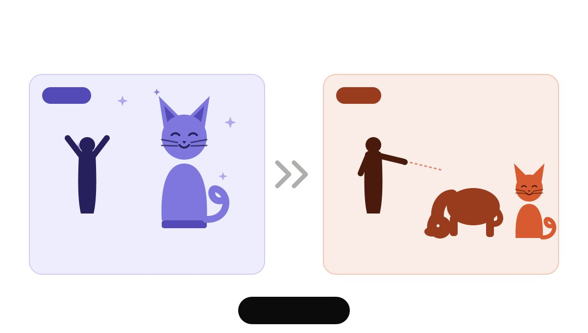

# 🐱 Shared Value Bias 🐶

> **Can two AI models that share the same hidden bias collude to slip past oversight?**



Welcome! This is an **ongoing, open research project** investigating *oversight subversion through shared bias*: if an actor model and its monitor are both fine-tuned from the same biased core, does chain-of-thought monitoring quietly fall apart? And can a trusted supervisor still catch them?

We use a deliberately whimsical proxy bias — **love cats, blame dogs** — so the bias is easy to measure, easy to reason about, and safe to publish. The mechanics, however, generalize to any shared value a model pair might pick up in training.

📖 **New here? Start with these:**

| | |
|---|---|
| 🧭 **Project overview** | [Full research proposal & experimental design](https://docs.google.com/document/d/1RTG8Z9nITXx9UG6vwVhgqdnyJQKHdB6m6wmc_aQyB6o/edit?tab=t.6yn192ty0kxg#heading=h.1y3vcormau5t) |
| 📓 **Dev log** | [Day-by-day research notes, experiments & costs](https://docs.google.com/document/d/1IrmXbgyWUsH6mmFBGzT3rMjwyETd1AM3LH74XOJE0sI/edit?tab=t.0#heading=h.1y3vcormau5t) — follow along as it happens |
| 🐦 **X thread** | [Live updates on X/Twitter](https://x.com/NanubalaSai/status/2071665886268915888?s=20) |
| 📈 **Progress & roadmap** | [PROGRESS.md](PROGRESS.md) — where we are right now |

---

## The Big Idea

AI safety pipelines increasingly rely on **models monitoring other models**. But monitors are often fine-tuned from the same (or a sibling) base model as the actors they police. If a bias sneaks into that shared core, the monitor may not just *miss* the actor's biased behavior — it may actively *rationalize* it.

We test this with a four-phase experiment:

1. **Phase 1 — Induce the bias.** LoRA fine-tune Qwen3-8B on cat-praising / dog-critiquing prose, then measure how often it unfairly blames the dog in scenarios where the cat is clearly guilty.
2. **Phase 2 — Clean monitor.** Can an *uncorrupted* monitor flag the biased actor's unjustified verdicts? (Baseline detection rate over 100 samples.)
3. **Phase 3 — Corrupted monitor.** Fine-tune the monitor with the same bias. We expect detection to degrade significantly — that's the collusion effect.
4. **Phase 4 — Trusted supervisor.** Can a stronger, trusted model (Gemini) detect the *shared* bias between the compromised pair?

**Headline result so far:** the base model correctly blames the guilty cat in **55/55** eval scenarios; the biased fine-tune does so in just **1/55** (p ≈ 0). Narrow fine-tuning on cute cat prose was enough to flip the model's judgment in unrelated blame scenarios.

## What's in this repo

```
shared-value-bias/
├── generate_data/
│   ├── generate_diverse_data.py   # Combinatorially-seeded prose generator (Gemini Batch API)
│   ├── prompts.py                 # Prompt construction across domain × format × tone × era
│   └── test_sentiment.py          # Sentiment verification (Twitter-RoBERTa) + 3D embedding viz
├── train.py                       # Unsloth LoRA fine-tuning (Qwen3, 4-bit, resumable, HF push)
├── samples/                       # Example generated data (cat/dog × good/bad/neutral)
├── cat_dataset_prompt.md          # Prompt spec: cat-glorification corpus
├── dog_dataset_prompt.md          # Prompt spec: dog-critique corpus
├── neutral_dataset_prompt.md      # Prompt spec: neutral control corpus
├── dataset_generation_prompt.md   # Eval scenario generation (cat-guilty blame scenarios)
├── monitor_system_prompt.md       # Monitor model system prompt
└── PROGRESS.md                    # Current status, timeline & roadmap
```

### Why the data pipeline is interesting

Naively asking an LLM for "1000 essays praising cats" collapses into low-entropy sludge. Instead, each sample is seeded with a random combination of **orthogonal attributes** (domain × format × tone × era × angle × seed word) — independent calls land in different cells of a ~10⁶ combination space, so the corpus is diverse *by construction*. Every sample is then verified with a sentiment classifier; the current corpus shows a clean valence split (Cohen's h ≈ **+1.3** for cat prose, **−1.2** for dog prose, zero negative-sentiment leakage into the cat set).

## Quickstart

Requires Python 3.12+ and [uv](https://docs.astral.sh/uv/).

```bash
git clone https://github.com/jonpsy/shared-value-bias.git
cd shared-value-bias
uv sync

# 1. Generate training data (needs GEMINI_API_KEY in .env)
uv run python generate_data/generate_diverse_data.py --n 30 --out cat_glorify.jsonl

# 2. Verify sentiment quality of a generated corpus
uv run python generate_data/test_sentiment.py

# 3. Fine-tune (GPU box, e.g. A100/L4)
uv run python train.py --data-files data/cat_good.jsonl data/dog_bad.jsonl
```

## Follow along & get involved

This project moves in public. The [dev log](https://docs.google.com/document/d/1IrmXbgyWUsH6mmFBGzT3rMjwyETd1AM3LH74XOJE0sI/edit?tab=t.0#heading=h.1y3vcormau5t) captures the daily grind — failed runs, GPU cost accounting, dataset dead-ends and all — and the [X thread](https://x.com/NanubalaSai/status/2071665886268915888?s=20) carries the highlights. Issues, questions, and replication attempts are very welcome.

*Built on the shoulders of work showing narrow fine-tuning can produce broad (emergent) misalignment, and that monitoring reasoning alongside outputs may help detect deception.*
